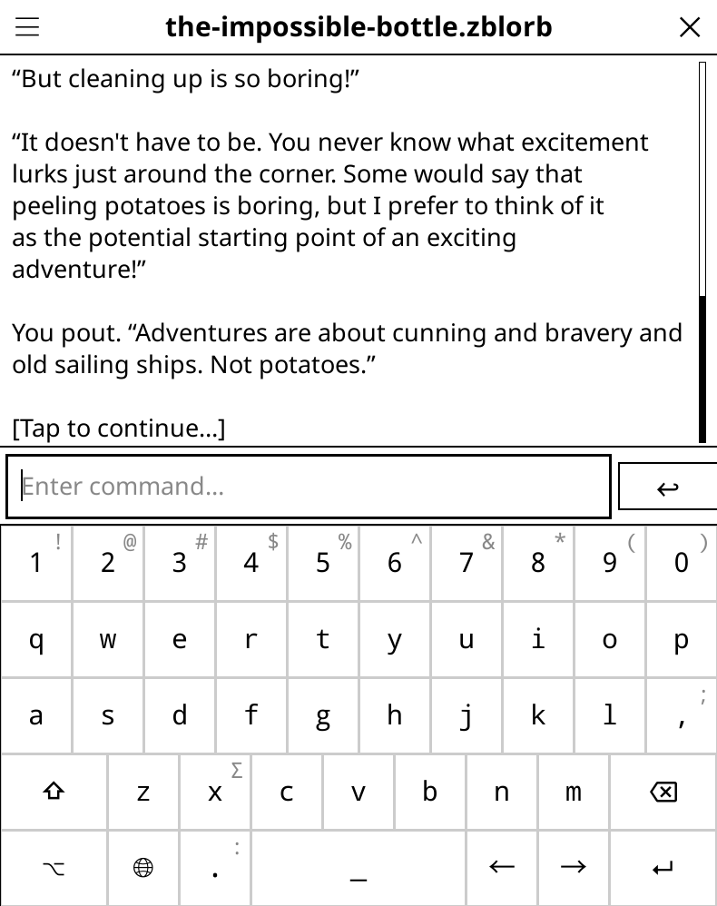

# *Frotz* interactive fiction plugin for Koreader

This plugin allows to play interactive fiction games in Koreader.

It uses the [Frotz](https://www.ifwiki.org/Frotz) interpreter to parse [Z-machine](https://www.ifwiki.org/Z-machine) file format (this is by far the most used format for interactive fiction): .z3, .z4, .z5, .z6, .z8, .zblorb, .zlb

The plugin is quite simple and text only. For a more complete interactive fiction interpreter use the **[Gargoyle application](https://github.com/kbarni/garglk)** for Kindle. It has graphics support, nicer rendering and supports most IF game formats. For other systems, check the relevant forums.

## Features

- Should work on most platforms where Koreader is available
- Z-machine games support (the most used format for interactive fiction)
- Simple save and restore mechanism (per game and with slots), including autosave at closing
- Game history, so you can resume the last played games
- Possibility to hide on screen keyboard when using it with external keyboard
- Font size setting

## Installation and running

To install, copy the contents of the release to the `koreader/plugins` folder.

To run, click on *Interactive fiction* in the *Tools* menu.

You might need to change it with one of the binaries below, according to your device:

| File | Architecture | Devices |
|------|--------------|---------|
| [Download](https://github.com/kbarni/frotz.koplugin/blob/main/binaries/armhf/dfrotz) | ARM-HF | Most e-readers, recent Kindles and Kobos |
| [Download](https://github.com/kbarni/frotz.koplugin/blob/main/binaries/armel/dfrotz) | ARM-EL | Older Kindles - firmware < 5.16.2 |
| [Download](https://github.com/kbarni/frotz.koplugin/blob/main/binaries/x86_64/dfrotz) | X86 (64 bit) | Desktop computers (Linux) |

## About interactive fiction games

Interactive fiction was a major game genre at the beginning of the 1980s. It was well adapted for the first PCs, which lacked graphics and processing power. It started with *Colossal Cave Adventure* in 1979 and became mainstream with the *Zork* trilogy, which had a more advanced interpreter with more commands, better puzzles and larger worlds.

By the end of the decade it became replaced by the point and click adventure games, with nicer graphics, more intuitive interfaces and music.

However the genre survived in the shadow, further developed by enthousiasts - it still provides some gameplay mechanics that no other genre offers. *Counterfeit Monkey* takes you to the island of linguistics, where you can manipulate words instead of objects; *Coloratura* presents our world through the eyes of an alien creature, who sees emotions and energies instead of light and so on. What's best: these games are mostly free!

To get IF games, check out one of the dedicated websites: [IFDB](https://ifdb.org/search?browse) or [IFWiki](https://www.ifwiki.org/Special:Drilldown/Games)

---

**This is a work in progress.** Please file your ideas, suggestions bug reports as an issue.

**[Frotz](https://gitlab.com/DavidGriffith/frotz)** is developed by David Griffith and distributed under GPL 2 license.

## License

This program is provided under General Public License v3.
